# Faculty Website Page Builder — Feature Specification

> **Who is this document for?**
> This document is written for everyone involved in the Faculty Website project — from faculty administrators and content editors with no technical background, to the developers building and maintaining the system. Sections are clearly labelled so you can jump to what matters most to you.

---

## Table of Contents

1. [The Big Picture — What Are We Building and Why?](#1-the-big-picture)
2. [Why We Chose This Approach — Branding & Autonomy](#2-why-we-chose-this-approach)
3. [How the System Works — Plain English](#3-how-the-system-works)
4. [For Faculty Managers — Your Practical Guide](#4-for-faculty-managers)
5. [Available Content Blocks — What You Can Build With](#5-available-content-blocks)
6. [Access Control — Who Can Do What](#6-access-control--permissions)
7. [Current vs Proposed System — The Upgrade in Detail](#7-current-vs-proposed-system)
8. [Technical Architecture — For Developers](#8-technical-architecture)
9. [Content Migration Plan](#9-content-migration-plan)
10. [Security](#10-security)
11. [Success Metrics — How We Know It's Working](#11-success-metrics)
12. [Implementation Timeline & Phases](#12-implementation-timeline--phases)
13. [Risk Assessment & Mitigation](#13-risk-assessment--mitigation)
14. [Training & Onboarding](#14-training--onboarding)
15. [Glossary](#15-glossary)
16. [FAQ](#16-faq)

---

## 1. The Big Picture

### What Are We Building and Why?

Villa College is growing. As the number of faculties increases, so does the challenge of keeping each faculty's website accurate, up-to-date, and professionally presented. Today, any change to a faculty website — even adding a new dean's message or updating a programme list — requires a developer to step in. This creates a bottleneck: faculties wait, developers are pulled away from bigger work, and websites go stale.

**The solution is to put content control in the hands of the people who know it best — the faculties themselves.**

We are building a **Faculty Website Page Builder**: a user-friendly interface inside the Villa College admin panel that allows each faculty's designated managers to independently create, edit, and publish their own website pages — no coding required.

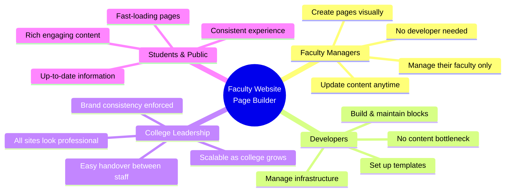

### The Problem We Are Solving

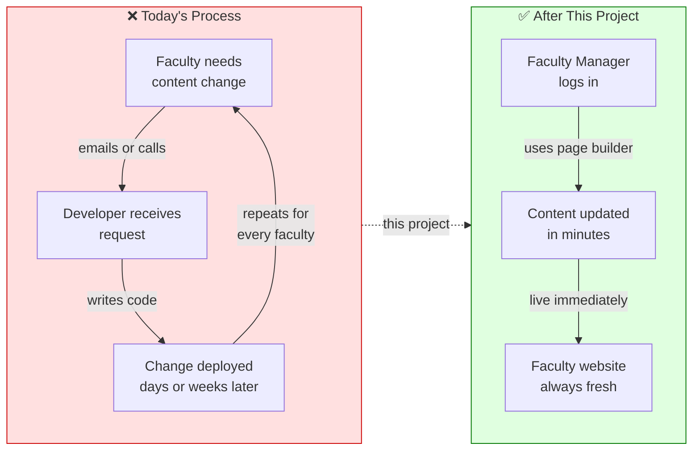

---

## 2. Why We Chose This Approach

### Branding & Autonomy — Two Goals, One Solution

There is a natural tension between two important goals:

- **Faculty Autonomy** — Each faculty should be able to manage their own content freely.
- **Brand Consistency** — All Villa College websites must look professional and follow the college's visual identity.

A free-form website builder (like giving everyone a blank WordPress) would enable autonomy but destroy brand consistency. Forcing everything through developers maintains brand control but kills autonomy.

**The page builder approach solves both at once:**

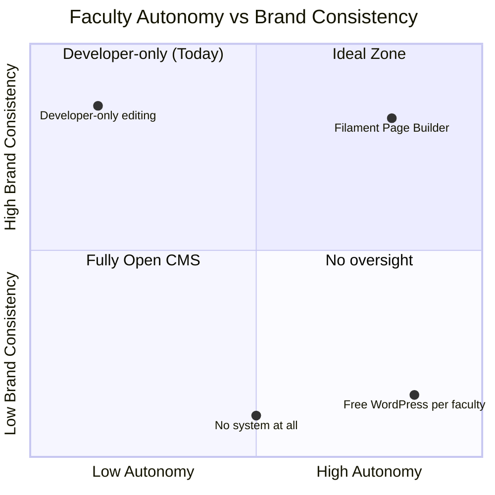

### Why Filament Page Builder Specifically?

> **Plain English:** Think of the page builder like LEGO bricks. The college's developers design and brand the bricks — each brick (called a "block") is already styled in Villa College's colours, fonts, and visual language. Faculty managers then pick and arrange those bricks to build their page. No matter which bricks a faculty chooses or in which order they place them, the end result always looks like a Villa College website.

The key insight is this: **because every block is pre-designed and pre-branded, every faculty website automatically matches the college's brand** — without faculty managers needing to worry about fonts, colours, or layout rules.

A second benefit: **once a faculty manager learns to use the page builder, they can contribute to any faculty website across the entire college.** The system is the same everywhere. This makes cross-faculty support, staff handovers, and training dramatically easier.

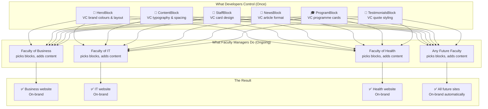

---

## 3. How the System Works

### The Overall Picture

The faculty website system is part of the larger Villa College website, which is built on **Laravel** (a web application framework) and uses **FilamentPHP** as the admin panel. The page builder component — **FilamentFabricator** — is the tool that allows non-technical users to build pages by combining content blocks.

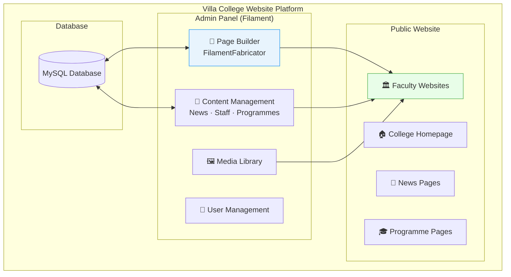

### A Faculty Manager's Journey — Step by Step

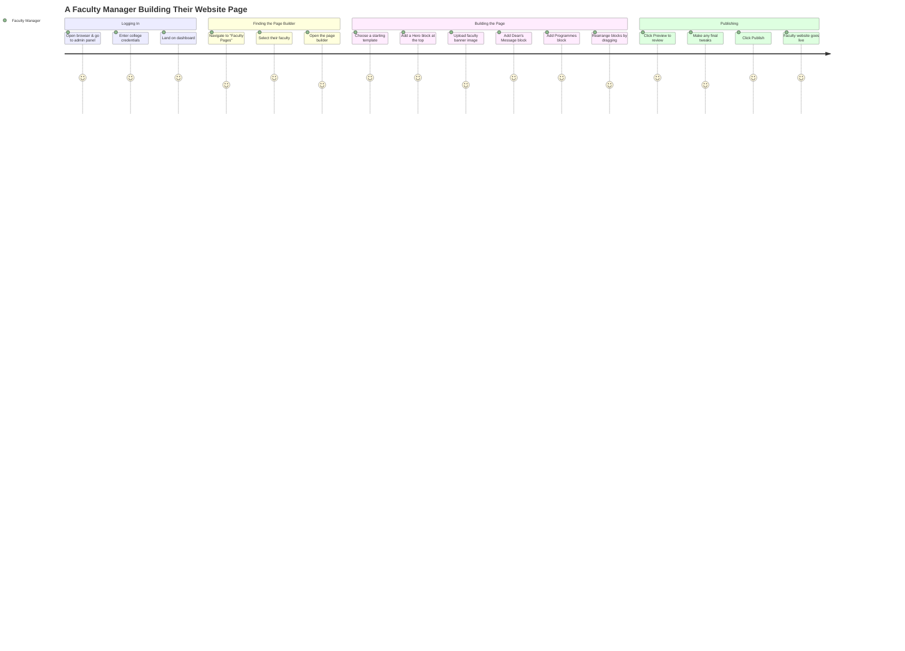

### How a Published Page Reaches the Public

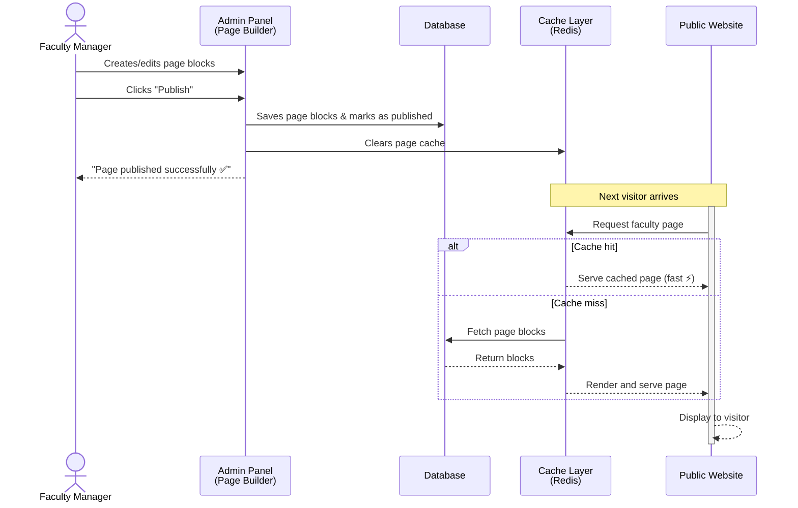

---

## 4. For Faculty Managers

> 🟢 **This section is for you if you are a Faculty Manager** — someone responsible for maintaining your faculty's website. No technical knowledge is needed to follow this guide.

### What You Can Do

As a Faculty Manager, you have full control over your faculty's website content. Here is a summary of everything you can do:

| What You Can Do | How |
|---|---|
| ✅ Create a new faculty page | Page Builder → New Page |
| ✅ Edit any existing page | Page Builder → Select Page → Edit |
| ✅ Add, remove, or rearrange content blocks | Drag and drop in the page builder |
| ✅ Upload images and files | Media Library |
| ✅ Preview before publishing | Preview button in the page builder |
| ✅ Save a draft without publishing | Save Draft button |
| ✅ Publish and unpublish pages | Publish / Unpublish toggle |
| ✅ See your faculty's news, staff, and programmes (automatically updated) | Dynamic content blocks |
| ❌ Edit another faculty's pages | Not permitted — access is restricted to your faculty |
| ❌ Change the block design / colours / fonts | These are managed by the technical team to maintain branding |

### Starting From a Template

When creating a new page, you do not have to start from scratch. Pre-built templates are available that mirror the current faculty website layout. Simply choose a template, then customise it with your own content.

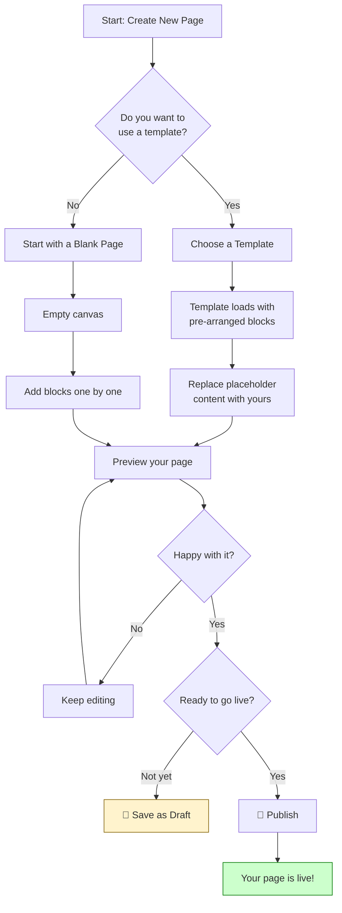

### Tips for Great Faculty Pages

- **Start with the Hero block** — this is your banner at the top of the page. Use a high-quality image that represents your faculty.
- **Keep the Dean's Message personal** — this is one of the first things visitors read. A warm, direct message works best.
- **Use the Programmes block** — it automatically pulls the latest programme data from the system, so it's always current.
- **Use the News block** — it automatically shows your most recent articles without any manual updates.
- **Preview on mobile** — many students browse on phones. Always check the mobile preview before publishing.

---

## 5. Available Content Blocks

> **What is a block?** A block is a pre-designed section of your page. You combine blocks like building bricks to create a complete page. Each block is already styled to match Villa College's brand.

The blocks documented in this section are derived directly from the actual page designs in the `faculty_website` branch. Every block corresponds to a real section in the faculty website templates.

---

### 5.1 Faculty Website Pages & Their Sections

The faculty website is made up of four main pages. Each page is built from a sequence of blocks:

```mermaid
graph TD
    subgraph HOME["🏠 Faculty Home Page"]
        H1[FacultyHeaderBlock<br/>Video hero + nav + CTA]
        H2[FacultyAboutBlock<br/>Stats cards + Dean's message]
        H3[WhyChooseUsBlock<br/>Feature cards on bg image]
        H4[FacultyCIEDBlock<br/>Programme showcase cards]
        H5[TestimonialsBlock<br/>Auto-carousel of reviews]
        H6[FacultyNewsBlock<br/>Latest news auto-carousel]
        H7[FacultyCTABlock<br/>Apply Now pre-footer]
        H1 --> H2 --> H3 --> H4 --> H5 --> H6 --> H7
    end

    subgraph ABOUT["👥 Faculty About Page"]
        A1[FacultyPageHeroBlock<br/>Title + banner image + stats row]
        A2[MissionVisionBlock<br/>Vision / Mission / Values cards]
        A3[TeamBlock<br/>Tabbed staff grid]
        A4[ResearchCTABlock<br/>Research database banner]
        A5[FacultyAdvisoryBlock<br/>Advisory committee members]
        A6[AccreditationsBlock<br/>Memberships + accreditations]
        A1 --> A2 --> A3 --> A4 --> A5 --> A6
    end

    subgraph CIED["💡 CIED Page"]
        C1[FacultyPageHeroBlock<br/>Title + description]
        C2[CIEDSpotlightBlock<br/>VIgnite banner with logo]
        C3[CIEDFeaturesBlock<br/>3 programme feature cards]
        C4[MentorsBlock<br/>Academic + industry mentors]
        C5[IdeaSubmissionCTABlock<br/>Submit your idea banner]
        C1 --> C2 --> C3 --> C4 --> C5
    end

    subgraph COMM["🎓 Student Life Page"]
        SL1[FacultyPageHeroBlock<br/>Title + description]
        SL2[StudentLifeContentBlock<br/>Clubs, events, communities]
        SL1 --> SL2
    end

    style HOME fill:#e8f4fd,stroke:#2196F3
    style ABOUT fill:#e8fde8,stroke:#4CAF50
    style CIED fill:#fff3e0,stroke:#FF9800
    style COMM fill:#fce4ec,stroke:#E91E63
```

---

### 5.2 Page Layout Wireframes

The following wireframes show the visual layout of each page as built in the `faculty_website` branch. These serve as the reference for what each block must produce.

#### Faculty Home Page Layout

```
┌─────────────────────────────────────────────────────────────────────┐
│  ██████████████████  FacultyHeaderBlock  ██████████████████████████  │
│  ┌──────────────────────────────────────────────────────────────┐   │
│  │  [Logo]  Home  About  Programs  CIED  Student Life  [Apply]  │   │  ← FacultyNavBlock
│  └──────────────────────────────────────────────────────────────┘   │
│  ░░░░░░░░░░░░░░░░░░░░  VIDEO BACKGROUND  ░░░░░░░░░░░░░░░░░░░░░░░░   │
│  ┌── Blue gradient overlay ──────────────────────────────────────┐   │
│  │  [ WATERMARK TEXT: "EXPERIENCE" ]                             │   │
│  │  Faculty Name Line 1  (large, bold, white)                    │   │
│  │  Faculty Name Line 2  (large, bold, white)                    │   │
│  │  Tagline / Description paragraph (white)                      │   │
│  │  [ Learn More About Us → ]                                    │   │
│  └───────────────────────────────────────────────────────────────┘   │
└─────────────────────────────────────────────────────────────────────┘

┌─────────────────────────────────────────────────────────────────────┐
│  ██████████████████  FacultyAboutBlock  ████████████████████████████  │
│                                                                     │
│  "Get to Know Us"  (small grey eyebrow)                            │
│  Section Heading   (large, navy bold)                              │
│                                                                     │
│  ┌──────────────────────┐  ┌──────────────────────────────────────┐ │
│  │ ┌────┐  ┌────┐       │  │  Dean's Message  (heading)           │ │
│  │ │STAT│  │STAT│       │  │                                      │ │
│  │ │ #1 │  │ #2 │       │  │  Long paragraph of message text...   │ │
│  │ └────┘  └────┘       │  │                                      │ │
│  │ ┌──────────────────┐ │  │  ┌────────────────┐  ┌───────────┐  │ │
│  │ │  About text card │ │  │  │  Continued...  │  │  Dean     │  │ │
│  │ │  (faculty name + │ │  │  │  message...    │  │  Photo    │  │ │
│  │ │   description)   │ │  │  │                │  │  + Name   │  │ │
│  │ └──────────────────┘ │  │  │                │  │  + Role   │  │ │
│  └──────────────────────┘  └──────────────────────────────────────┘ │
└─────────────────────────────────────────────────────────────────────┘

┌─────────────────────────────────────────────────────────────────────┐
│  ██████████████  WhyChooseUsBlock  ████████████████████████████████  │
│  ░░░░░░░░░░░░░░░░  BACKGROUND IMAGE  ░░░░░░░░░░░░░░░░░░░░░░░░░░░░  │
│                                                                     │
│  "Quality Education, Proven Results"  (eyebrow)                    │
│  Why Choose Us  (heading)                                          │
│                                                                     │
│  ┌─────────────────┐  ┌─────────────────┐  ┌─────────────────┐    │
│  │  [Icon Image]   │  │  [Icon Image]   │  │  [Icon Image]   │    │
│  │  Card Title     │  │  Card Title     │  │  Card Title     │    │
│  │  Description    │  │  Description    │  │  Description    │    │
│  │  text...        │  │  text...        │  │  text...        │    │
│  └─────────────────┘  └─────────────────┘  └─────────────────┘    │
└─────────────────────────────────────────────────────────────────────┘

┌─────────────────────────────────────────────────────────────────────┐
│  ██████████████  FacultyCIEDBlock  ████████████████████████████████  │
│  (light blue gradient background)                                   │
│                                                                     │
│  "Centre for Innovation..."  (eyebrow)                             │
│  Section Heading  (navy)                                           │
│  Section Description paragraph                                     │
│                                                                     │
│  ┌───────────────────────────┐  ┌───────────────────────────┐      │
│  │  [Cover Image]            │  │  [Cover Image]            │      │
│  │  Programme Title          │  │  Programme Title          │      │
│  │  Short description...     │  │  Short description...     │      │
│  │                [Learn More→]│  │                [Learn More→]│      │
│  └───────────────────────────┘  └───────────────────────────┘      │
└─────────────────────────────────────────────────────────────────────┘

┌─────────────────────────────────────────────────────────────────────┐
│  █████████████  TestimonialsBlock  ████████████████████████████████  │
│  "Testimonials"  (eyebrow)                                         │
│  "In Their Own Words..."  (heading)                                │
│                                                                     │
│  ◀  [Photo] Name · Role · Date       [Photo] Name · Date  ▶       │
│     "Quote text truncated to 80 words...  read more"               │
└─────────────────────────────────────────────────────────────────────┘

┌─────────────────────────────────────────────────────────────────────┐
│  ███████████████  FacultyNewsBlock  ████████████████████████████████  │
│  (light blue background)                                           │
│                                                                     │
│  Recent News  ────────────────────────────── All news →           │
│                                                                     │
│  ◀  [Image]      [Image]      [Image]      [Image]    ▶           │
│     Date          Date          Date          Date                  │
│     Title         Title         Title         Title                 │
│     Learn More→   Learn More→   Learn More→   Learn More→          │
└─────────────────────────────────────────────────────────────────────┘

┌─────────────────────────────────────────────────────────────────────┐
│  ████████████████  FacultyCTABlock  ████████████████████████████████  │
│  (solid blue background #0050F2)                                   │
│                                                                     │
│             "Ready to Start Your Journey?"  (large white heading)  │
│             Supporting subtext (white, lighter weight)             │
│                                                                     │
│             [ Apply Now → ]    [ View Programs ]                   │
│             (white filled)     (white outlined)                    │
└─────────────────────────────────────────────────────────────────────┘
```

#### Faculty About Page Layout

```
┌─────────────────────────────────────────────────────────────────────┐
│  ████████████  FacultyPageHeroBlock  ███████████████████████████████  │
│  [Nav bar - blue background]                                       │
│                                                                     │
│  Faculty Acronym  (large, navy)                                    │
│  Faculty full description paragraph (slate)                        │
│                                                                     │
│  ┌─────────────────────────────────────────────────────────────┐   │
│  │          Banner / Cover Image  (16:7 aspect ratio)           │   │
│  └─────────────────────────────────────────────────────────────┘   │
│                                                                     │
│  [ Faculty Members: 34 ]  [ Programs: 18 ]  [ Graduates: 100k+ ]  [ Partners: 40 ]  │
└─────────────────────────────────────────────────────────────────────┘

┌─────────────────────────────────────────────────────────────────────┐
│  ██████████████  MissionVisionBlock  ████████████████████████████████  │
│  ┌────────────────┐  ┌────────────────┐  ┌────────────────┐        │
│  │  [Icon]        │  │  [Icon]        │  │  [Icon]        │        │
│  │  Vision        │  │  Mission       │  │  Values        │        │
│  │  description   │  │  description   │  │  description   │        │
│  └────────────────┘  └────────────────┘  └────────────────┘        │
└─────────────────────────────────────────────────────────────────────┘

┌─────────────────────────────────────────────────────────────────────┐
│  ████████████████  TeamBlock  ██████████████████████████████████████  │
│  "Our Team"  /  "The Team Committed to Your Success"               │
│                                                                     │
│  [Leadership]  Academic Staff  Administrative Staff  (tab filter)  │
│                                                                     │
│  ┌──────────┐  ┌──────────┐  ┌──────────┐  ┌──────────┐          │
│  │  Photo   │  │  Photo   │  │  Photo   │  │  Photo   │          │
│  │  Name    │  │  Name    │  │  Name    │  │  Name    │          │
│  │  Role    │  │  Role    │  │  Role    │  │  Role    │          │
│  └──────────┘  └──────────┘  └──────────┘  └──────────┘          │
└─────────────────────────────────────────────────────────────────────┘

┌─────────────────────────────────────────────────────────────────────┐
│  ███████████████  ResearchCTABlock  ████████████████████████████████  │
│  (background image)                                                │
│  [Icon]  Heading  /  Description  /  [ CTA Button → ]             │
└─────────────────────────────────────────────────────────────────────┘

┌─────────────────────────────────────────────────────────────────────┐
│  ███████████  FacultyAdvisoryBlock  ████████████████████████████████  │
│  Faculty Advisory Committee (heading)                              │
│                                                                     │
│  Committee Chair         Industry Representatives                  │
│  ┌──────────────────┐    ┌──────────────────────────────────────┐  │
│  │  Name · Role ·   │    │  Name · Role  │  Name · Role         │  │
│  │  Institution     │    │  Institution  │  Institution         │  │
│  └──────────────────┘    └──────────────────────────────────────┘  │
│  ┌────────────────────────────────────────────────────────────────┐ │
│  │  Member 1  │  Member 2  │  Member 3  (full width row)          │ │
│  └────────────────────────────────────────────────────────────────┘ │
└─────────────────────────────────────────────────────────────────────┘

┌─────────────────────────────────────────────────────────────────────┐
│  ████████████  AccreditationsBlock  ████████████████████████████████  │
│  Accreditations & Memberships (heading)                            │
│                                                                     │
│  Memberships                    Accreditations                     │
│  ┌─────────────────────────┐    ┌─────────────────────────┐        │
│  │  AMDISA                 │    │  SAQS                   │        │
│  │  description            │    │  description            │        │
│  └─────────────────────────┘    └─────────────────────────┘        │
│  ┌─────────────────────────┐    ┌─────────────────────────┐        │
│  │  AACSB                  │    │  ACCA ALP Gold          │        │
│  │  description            │    │  description            │        │
│  └─────────────────────────┘    └─────────────────────────┘        │
└─────────────────────────────────────────────────────────────────────┘
```

#### CIED Page Layout

```
┌─────────────────────────────────────────────────────────────────────┐
│  ████████████  FacultyPageHeroBlock  ███████████████████████████████  │
│  [Nav bar - blue background]                                       │
│  Page Title  (large, navy)  /  Description paragraph (slate)      │
└─────────────────────────────────────────────────────────────────────┘

┌─────────────────────────────────────────────────────────────────────┐
│  ████████████  CIEDSpotlightBlock  █████████████████████████████████  │
│  (light blue background #F1FAFF)                                   │
│  ┌──────────────────────────────────────────────────────────────┐   │
│  │  [Programme Logo/SVG]   Programme Name  (large, navy)        │   │
│  │                         Description paragraph (slate)        │   │
│  │                         [ Learn More → ]  (blue button)      │   │
│  └──────────────────────────────────────────────────────────────┘   │
└─────────────────────────────────────────────────────────────────────┘

┌─────────────────────────────────────────────────────────────────────┐
│  ████████████  CIEDFeaturesBlock  ██████████████████████████████████  │
│  ┌─────────────────────┐  ┌─────────────────────┐  ┌──────────────┐ │
│  │  Feature Title      │  │  Feature Title      │  │  Feature     │ │
│  │  Description        │  │  Description        │  │  Title       │ │
│  └─────────────────────┘  └─────────────────────┘  └──────────────┘ │
└─────────────────────────────────────────────────────────────────────┘

┌─────────────────────────────────────────────────────────────────────┐
│  ████████████████  MentorsBlock  ███████████████████████████████████  │
│  "Our Mentors"  /  description text                                │
│                                                                     │
│  Academic Mentors               Industry Mentors                   │
│  Title + description            Title + description                │
│  ┌────────────────────────┐     ┌────────────────────────┐         │
│  │  Name  /  Role  /  Org │     │  Name  /  Role  /  Org │         │
│  │  Name  /  Role  /  Org │     │  Name  /  Role  /  Org │         │
│  │  Name  /  Role  /  Org │     │  Name  /  Role  /  Org │         │
│  └────────────────────────┘     └────────────────────────┘         │
└─────────────────────────────────────────────────────────────────────┘

┌─────────────────────────────────────────────────────────────────────┐
│  ████████████  IdeaSubmissionCTABlock  █████████████████████████████  │
│  (background image)                                                │
│  [Icon image]  Heading  /  Description  /  [ Submit Idea → ]      │
└─────────────────────────────────────────────────────────────────────┘
```

---

### 5.3 Block Specifications

Each block below is directly derived from the existing design in the `faculty_website` branch. The **Configurable Fields** list exactly what a Faculty Manager will fill in through the page builder form.

---

#### `FacultyHeaderBlock` — Video Hero Header

**Used on:** Faculty Home Page (top of page, always first)

**What it looks like:** A full-viewport-height section with a looping background video overlaid with a blue gradient, a large faculty name, tagline, and a CTA button. The faculty navigation bar sits inside this block at the top.

**How it maps to the design:** Directly mirrors `faculty-header.blade.php` — the video hero with overlay, watermark background text, two-line faculty name, description, and the "Learn More About Us" button.

| Field | Type | Description |
|---|---|---|
| Background video | File upload | `.mp4` file for the looping hero background |
| Overlay colour | Colour picker | Gradient overlay colour (default: `#0050F2`) |
| Watermark text | Text input | Large ghost text shown behind content (e.g. "EXPERIENCE") |
| Faculty name — line 1 | Text input | First line of faculty name (e.g. "Qasim Ibrahim") |
| Faculty name — line 2 | Text input | Second line / subtitle (e.g. "School of Business") |
| Tagline / description | Textarea | Short paragraph shown below the name |
| CTA button label | Text input | Button text (e.g. "Learn More About Us") |
| CTA button URL | URL input | Where the button links to |

---

#### `FacultyNavBlock` — Faculty Navigation Bar

**Used on:** All faculty pages (embedded inside the header on home; standalone blue bar on inner pages)

**What it looks like:** A horizontal navigation bar with the Villa College logo on the left, faculty-specific nav links in the centre, and an "Apply Now" button on the right.

**How it maps to the design:** Directly mirrors `faculty-nav.blade.php`.

| Field | Type | Description |
|---|---|---|
| Nav links | Repeater (up to 6) | Each entry: Label + URL |
| Apply Now button label | Text input | CTA button label (default: "Apply Now") |
| Apply Now button URL | URL input | Link for the CTA button |
| Show login link | Toggle | Show/hide the "Login" link |

---

#### `FacultyAboutBlock` — About Us with Stats & Dean's Message

**Used on:** Faculty Home Page

**What it looks like:** A two-column section. Left side has two square stat cards (coloured dark navy and blue) plus a wide "About" text card spanning both columns below them. Right side shows the Dean's Message with a photo of the Dean pinned to the bottom right.

**How it maps to the design:** Mirrors the "about us" section in `faculty-home.blade.php` — the `5/12` left column with the three rounded cards, and the `7/12` right column with the Dean's message, multi-paragraph text, and the Dean's profile card.

| Field | Type | Description |
|---|---|---|
| Eyebrow label | Text input | Small text above heading (e.g. "Get to Know Us") |
| Section heading | Text input | Main section title |
| Stat 1 — value | Text input | Numeric value (e.g. "123,000+") |
| Stat 1 — label | Text input | Description (e.g. "Students Graduated") |
| Stat 1 — background colour | Colour picker | Card background (default: `#001C55`) |
| Stat 2 — value | Text input | Numeric value |
| Stat 2 — label | Text input | Description |
| Stat 2 — background colour | Colour picker | Card background (default: `#0050F2`) |
| About card heading | Text input | Bold title inside the wide bottom card |
| About card body | Textarea | Faculty description paragraph |
| About card background colour | Colour picker | (default: `#0037A7`) |
| Dean's message heading | Text input | (default: "Deans Message") |
| Dean's message body | Rich text editor | Full message, supports multiple paragraphs |
| Dean's photo | Image upload | Portrait photo of the Dean |
| Dean's name | Text input | Full name |
| Dean's title / role | Text input | Official title (e.g. "Dean — QISB") |

---

#### `WhyChooseUsBlock` — Why Choose Us Feature Cards

**Used on:** Faculty Home Page

**What it looks like:** A section with a full-width background image and up to three feature cards, each with an icon image, bold title, and a description paragraph. Cards have a frosted white background and a hover scale + glow effect.

**How it maps to the design:** Mirrors the "why choose us" section in `faculty-home.blade.php`.

| Field | Type | Description |
|---|---|---|
| Background image | Image upload | Full-section background image |
| Eyebrow label | Text input | Small text above heading |
| Section heading | Text input | Main "Why Choose Us" heading |
| Feature cards | Repeater (1–6) | Each card contains: |
| → Icon image | Image upload | Icon displayed at top of card |
| → Card title | Text input | Bold card heading |
| → Card description | Textarea | Descriptive paragraph text |

---

#### `FacultyCIEDBlock` — CIED Programme Showcase

**Used on:** Faculty Home Page

**What it looks like:** A section with a light blue gradient background, a heading + description, and a grid of programme cards (up to 4). Each card has a cover image, a title, a short description, and a "Learn More" button.

**How it maps to the design:** Mirrors the "CIED" section in `faculty-home.blade.php`.

| Field | Type | Description |
|---|---|---|
| Eyebrow label | Text input | Small text above heading (e.g. "Centre for Innovation...") |
| Section heading | Text input | Main heading |
| Section description | Textarea | Introductory paragraph |
| Programme cards | Repeater (1–4) | Each card contains: |
| → Cover image | Image upload | Card banner image (aspect-video) |
| → Programme title | Text input | Bold card title |
| → Short description | Textarea | Card description paragraph |
| → Button label | Text input | CTA button text (e.g. "Learn More") |
| → Button URL | URL input | Where the button links |

---

#### `TestimonialsBlock` — Testimonials Carousel

**Used on:** Faculty Home Page

**What it looks like:** An auto-sliding carousel of testimonial cards, each showing a circular profile photo, the person's name, role, date, and a quote truncated to 80 words with a "read more" link.

**How it maps to the design:** Mirrors the "Testimonials" section in `faculty-home.blade.php`. Uses the `Testimonial` model, filtered to the current faculty's programmes.

| Field | Type | Description |
|---|---|---|
| Eyebrow label | Text input | Small text above heading (e.g. "Testimonials") |
| Section heading | Text input | Main heading |
| Autoplay delay (ms) | Number input | Delay between slides (default: 8000ms) |
| Data source | Auto | Pulls from `Testimonial` model scoped to faculty |

> ✨ Testimonial content is managed separately in the admin panel under the Testimonials section — not entered inside the block itself.

---

#### `FacultyNewsBlock` — Latest News Carousel

**Used on:** Faculty Home Page

**What it looks like:** A light blue background section showing the latest news articles as an auto-sliding carousel. Each card shows a cover image, date, article title, and a "Learn More" link. An "All news →" link sits in the section header.

**How it maps to the design:** Mirrors the "News" section in `faculty-home.blade.php`. Pulls the latest 4 posts from `Post` model filtered to the faculty.

| Field | Type | Description |
|---|---|---|
| Section heading | Text input | (default: "Recent News") |
| "All news" link URL | URL input | Where the "All news →" link points |
| Number of articles to show | Number input | How many articles to fetch (default: 4) |
| Autoplay delay (ms) | Number input | Carousel autoplay speed (default: 8000ms) |
| Data source | Auto | Pulls from `Post` model scoped to faculty |

---

#### `FacultyCTABlock` — Pre-Footer Call to Action

**Used on:** Faculty Home Page (last section before footer)

**What it looks like:** A full-width solid blue section with a large white heading, a supporting subtext paragraph, and two buttons side by side — one filled white and one white-outlined.

**How it maps to the design:** Mirrors the "Pre-Footer" section in `faculty-home.blade.php`.

| Field | Type | Description |
|---|---|---|
| Background colour | Colour picker | Section background (default: `#0050F2`) |
| Heading | Text input | Large heading (e.g. "Ready to Start Your Journey?") |
| Subtext | Textarea | Supporting paragraph |
| Primary button label | Text input | Filled button text (e.g. "Apply Now") |
| Primary button URL | URL input | Where the primary button links |
| Secondary button label | Text input | Outlined button text (e.g. "View Programs") |
| Secondary button URL | URL input | Where the secondary button links |

---

#### `FacultyPageHeroBlock` — Inner Page Hero

**Used on:** About Page, CIED Page, Student Life Page (top of inner pages)

**What it looks like:** A compact hero section with a blue nav bar at the top, a centred faculty acronym/page title, a description paragraph, an optional full-width cover image (16:7 aspect ratio), and an optional row of 4 key statistics beneath the image.

**How it maps to the design:** Mirrors the hero section at the top of `faculty-about.blade.php` and `faculty-cied.blade.php`.

| Field | Type | Description |
|---|---|---|
| Page title / acronym | Text input | Bold heading (e.g. "QISB" or "Centre for Innovation...") |
| Description paragraph | Textarea | Introductory text shown below the title |
| Cover / banner image | Image upload | Optional wide banner image (16:7 ratio recommended) |
| Show stats row | Toggle | Show/hide the statistics row below the image |
| Stats | Repeater (up to 4) | Each stat: value (e.g. "34") + label (e.g. "Faculty Members") |

---

#### `MissionVisionBlock` — Mission, Vision & Values Cards

**Used on:** About Page

**What it looks like:** A 3-column card grid. Each card has a circular white icon container on a light blue background, a bold title, and a description paragraph.

**How it maps to the design:** Mirrors the "mission and vision" section in `faculty-about.blade.php`.

| Field | Type | Description |
|---|---|---|
| Cards | Repeater (1–3) | Each card contains: |
| → Icon image | Image upload | Icon displayed in the circular container |
| → Title | Text input | Card heading (e.g. "Vision") |
| → Description | Textarea | Body text for the card |

---

#### `TeamBlock` — Staff Directory with Category Tabs

**Used on:** About Page

**What it looks like:** A section with an eyebrow label and heading, three filter tabs (Leadership / Academic Staff / Administrative Staff), and a 4-column grid of staff portrait cards. Each card shows a photo as the background, with the staff member's name and role in a white box at the bottom.

**How it maps to the design:** Mirrors the "our team" section in `faculty-about.blade.php`.

| Field | Type | Description |
|---|---|---|
| Eyebrow label | Text input | (default: "Our Team") |
| Section heading | Text input | (e.g. "The Team Committed to Your Success") |
| Tab groups | Repeater (1–5) | Each tab: label (e.g. "Leadership") + staff category filter |
| Staff data source | Toggle | Auto from DB (filtered by faculty) or manual entries |
| Manual staff entries | Repeater | Each: photo upload, name, role/title |

> ✨ When "Auto from DB" is on, the block pulls staff from the `Staff` model scoped to the faculty, filtered by category per tab.

---

#### `ResearchCTABlock` — Research Database Banner

**Used on:** About Page

**What it looks like:** A wide rounded card with a background image, a decorative icon on the left, a heading + description on the right, and a single CTA button.

**How it maps to the design:** Mirrors the research access banner in `faculty-about.blade.php` (the card with `paper-icon.png` and "Access Research Database" button).

| Field | Type | Description |
|---|---|---|
| Background image | Image upload | Banner background (e.g. `why-us-bg.png` pattern) |
| Icon image | Image upload | Decorative icon on the left |
| Heading | Text input | Bold heading |
| Description | Textarea | Supporting paragraph |
| Button label | Text input | CTA button text |
| Button URL | URL input | Where the button links |

---

#### `FacultyAdvisoryBlock` — Faculty Advisory Committee

**Used on:** About Page

**What it looks like:** A section with a heading, followed by a two-column layout. Left side shows the Committee Chair. Right side shows Industry Representatives in a two-column sub-grid. A full-width row beneath shows additional members.

**How it maps to the design:** Mirrors the "Faculty Advisory Committee" section in `faculty-about.blade.php`.

| Field | Type | Description |
|---|---|---|
| Section heading | Text input | (default: "Faculty Advisory Committee") |
| Committee Chair | Sub-group | Name, Role/Title, Institution |
| Industry Representatives | Repeater | Each: Name, Role/Title, Institution (shown in 2-col grid) |
| Additional members | Repeater | Each: Name, Role/Title, Institution (full-width row) |

---

#### `AccreditationsBlock` — Accreditations & Memberships

**Used on:** About Page

**What it looks like:** A two-column section. Left column lists Memberships; right column lists Accreditations. Each entry is a rounded card with a bold name and a description.

**How it maps to the design:** Mirrors the "Accreditations & Memberships" section in `faculty-about.blade.php`.

| Field | Type | Description |
|---|---|---|
| Section heading | Text input | (default: "Accreditations & Memberships") |
| Memberships column heading | Text input | (default: "Memberships") |
| Memberships | Repeater | Each: Name (bold) + Description text |
| Accreditations column heading | Text input | (default: "Accreditations") |
| Accreditations | Repeater | Each: Name (bold) + Description text |

---

#### `CIEDSpotlightBlock` — Programme Spotlight Banner

**Used on:** CIED Page

**What it looks like:** A large rounded banner card with a light blue background, a programme logo/SVG on the left, and the programme name, description, and "Learn more" button on the right.

**How it maps to the design:** Mirrors the "VIgnite Business Incubator" spotlight in `faculty-cied.blade.php`.

| Field | Type | Description |
|---|---|---|
| Programme logo | Image upload | Logo / SVG (e.g. VIgnite logo, displayed at w-44) |
| Programme name | Text input | Bold heading (e.g. "VIgnite Business Incubator") |
| Description | Textarea | Supporting paragraph |
| Button label | Text input | (e.g. "Learn more") |
| Button URL | URL input | Where the button links |
| Background colour | Colour picker | Card background (default: `#F1FAFF`) |

---

#### `CIEDFeaturesBlock` — CIED Feature Cards Grid

**Used on:** CIED Page

**What it looks like:** A 3-column grid of small rounded cards, each with a bold title and a short description. Used to highlight key aspects of CIED programmes (e.g. "Concept to Business", "Global Entrepreneurship Week").

**How it maps to the design:** Mirrors the three feature cards below the VIgnite spotlight in `faculty-cied.blade.php`.

| Field | Type | Description |
|---|---|---|
| Feature cards | Repeater (1–6) | Each card: Title (bold, navy) + Description (slate) |
| Background colour | Colour picker | Card background (default: `#F1FAFF`) |

---

#### `MentorsBlock` — Mentors Directory

**Used on:** CIED Page

**What it looks like:** A full-width two-column section. Left column lists Academic Mentors; right column lists Industry Mentors. Each column has a heading, a short description, and a list of mentor entries in a rounded card, separated by dividers.

**How it maps to the design:** Mirrors the "Our Mentors" section in `faculty-cied.blade.php`.

| Field | Type | Description |
|---|---|---|
| Section heading | Text input | (default: "Our Mentors") |
| Section description | Textarea | Introductory text |
| Left column heading | Text input | (default: "Academic Mentor") |
| Left column description | Textarea | Sub-description for academic mentors |
| Academic mentors | Repeater | Each: Name, Title/Role, Institution |
| Right column heading | Text input | (default: "Industry Mentor") |
| Right column description | Textarea | Sub-description for industry mentors |
| Industry mentors | Repeater | Each: Name, Title/Role, Institution |

---

#### `IdeaSubmissionCTABlock` — Submit Business Idea Banner

**Used on:** CIED Page

**What it looks like:** A wide rounded card with a patterned background image, a decorative icon on the left, a heading, description, and a "Submit Idea" button.

**How it maps to the design:** Mirrors the "Submit Your Business Ideas" banner at the bottom of `faculty-cied.blade.php`.

| Field | Type | Description |
|---|---|---|
| Background image | Image upload | Patterned background (e.g. `why-us-bg.png`) |
| Icon image | Image upload | Decorative icon (e.g. `arrow-icon.png`) |
| Heading | Text input | Bold heading |
| Description | Textarea | Supporting text (supports line breaks) |
| Button label | Text input | (default: "Submit Idea") |
| Button URL | URL input | Idea submission form URL |

---

### 5.4 Shared / General-Purpose Blocks

These blocks are **already implemented** in the `faculty_website` branch and are available for use on any faculty page:

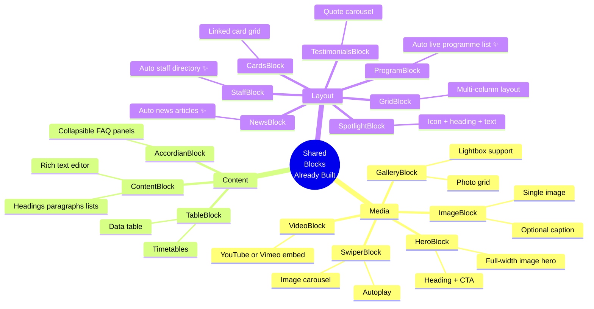

| Block | File | Purpose |
|---|---|---|
| `HeroBlock` | `HeroBlock.php` | Full-width image banner with heading and CTA |
| `ContentBlock` | `ContentBlock.php` | Rich-text content — headings, paragraphs, lists |
| `GridBlock` | `GridBlock.php` | Multi-column layout container |
| `SpotlightBlock` | `SpotlightBlock.php` | Icon + heading + text feature highlight |
| `SwiperBlock` | `SwiperBlock.php` | Auto-sliding image carousel |
| `TableBlock` | `TableBlock.php` | Formatted data table (timetables, fee structures) |
| `VideoBlock` | `VideoBlock.php` | Embedded video (YouTube / Vimeo / upload) |
| `ImageBlock` | `ImageBlock.php` | Single image with optional caption |
| `GalleryBlock` | `GalleryBlock.php` | Responsive photo grid with lightbox |
| `AccordianBlock` | `AccordianBlock.php` | Collapsible FAQ / accordion panels |
| `CardsBlock` | `CardsBlock.php` | Grid of clickable cards |
| `ProgramBlock` | `ProgramBlock.php` | ✨ Auto-pulls live programme data for the faculty |
| `StaffBlock` | `StaffBlock.php` | ✨ Auto-pulls staff directory for the faculty |
| `NewsBlock` | `NewsBlock.php` | ✨ Auto-pulls latest news articles for the faculty |
| `TestimonialsBlock` | `TestimonialsBlock.php` | Testimonial carousel |

> ✨ **Auto from DB** — these blocks pull live data automatically. No manual updates needed when programmes, staff, or news articles change.

---

### 5.5 Complete Block Inventory

```mermaid
graph LR
    subgraph NEW["🆕 New Blocks to Build"]
        N1[FacultyHeaderBlock]
        N2[FacultyNavBlock]
        N3[FacultyAboutBlock]
        N4[WhyChooseUsBlock]
        N5[FacultyCIEDBlock]
        N6[FacultyNewsBlock]
        N7[FacultyCTABlock]
        N8[FacultyPageHeroBlock]
        N9[MissionVisionBlock]
        N10[TeamBlock]
        N11[ResearchCTABlock]
        N12[FacultyAdvisoryBlock]
        N13[AccreditationsBlock]
        N14[CIEDSpotlightBlock]
        N15[CIEDFeaturesBlock]
        N16[MentorsBlock]
        N17[IdeaSubmissionCTABlock]
    end

    subgraph EXISTS["✅ Already Built"]
        E1[HeroBlock]
        E2[ContentBlock]
        E3[GridBlock]
        E4[SpotlightBlock]
        E5[SwiperBlock]
        E6[TableBlock]
        E7[VideoBlock]
        E8[ImageBlock]
        E9[GalleryBlock]
        E10[AccordianBlock]
        E11[CardsBlock]
        E12[ProgramBlock]
        E13[StaffBlock]
        E14[NewsBlock]
        E15[TestimonialsBlock]
    end

    style NEW fill:#fff3cd,stroke:#856404
    style EXISTS fill:#d4edda,stroke:#155724
```

| # | Block | Status | Page(s) Used On |
|---|---|---|---|
| 1 | `FacultyHeaderBlock` | 🆕 Build | Home |
| 2 | `FacultyNavBlock` | 🆕 Build | All pages |
| 3 | `FacultyAboutBlock` | 🆕 Build | Home |
| 4 | `WhyChooseUsBlock` | 🆕 Build | Home |
| 5 | `FacultyCIEDBlock` | 🆕 Build | Home |
| 6 | `FacultyNewsBlock` | 🆕 Build | Home |
| 7 | `FacultyCTABlock` | 🆕 Build | Home |
| 8 | `FacultyPageHeroBlock` | 🆕 Build | About · CIED · Student Life |
| 9 | `MissionVisionBlock` | 🆕 Build | About |
| 10 | `TeamBlock` | 🆕 Build | About |
| 11 | `ResearchCTABlock` | 🆕 Build | About |
| 12 | `FacultyAdvisoryBlock` | 🆕 Build | About |
| 13 | `AccreditationsBlock` | 🆕 Build | About |
| 14 | `CIEDSpotlightBlock` | 🆕 Build | CIED |
| 15 | `CIEDFeaturesBlock` | 🆕 Build | CIED |
| 16 | `MentorsBlock` | 🆕 Build | CIED |
| 17 | `IdeaSubmissionCTABlock` | 🆕 Build | CIED |
| 18 | `HeroBlock` | ✅ Exists | Any |
| 19 | `ContentBlock` | ✅ Exists | Any |
| 20 | `GridBlock` | ✅ Exists | Any |
| 21 | `SpotlightBlock` | ✅ Exists | Any |
| 22 | `SwiperBlock` | ✅ Exists | Any |
| 23 | `TableBlock` | ✅ Exists | Any |
| 24 | `VideoBlock` | ✅ Exists | Any |
| 25 | `ImageBlock` | ✅ Exists | Any |
| 26 | `GalleryBlock` | ✅ Exists | Any |
| 27 | `AccordianBlock` | ✅ Exists | Any |
| 28 | `CardsBlock` | ✅ Exists | Any |
| 29 | `ProgramBlock` | ✅ Exists | Any |
| 30 | `StaffBlock` | ✅ Exists | Any |
| 31 | `NewsBlock` | ✅ Exists | Any |
| 32 | `TestimonialsBlock` | ✅ Exists | Any |

---

## 6. Access Control & Permissions

### Roles Explained in Plain English

The system has four types of users. Your role determines which parts of the system you can access:

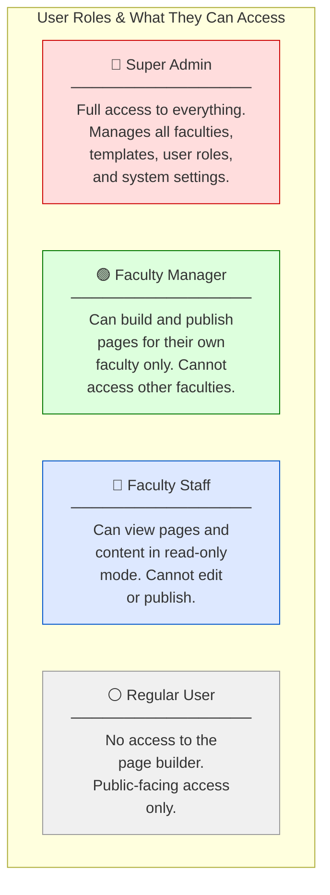

### Full Permissions Matrix

| Permission | 🔴 Super Admin | 🟢 Faculty Manager | 🔵 Faculty Staff | ⚪ Regular User |
|---|:---:|:---:|:---:|:---:|
| View any faculty page | ✅ | ✅ Own only | ✅ Own only | ❌ |
| Create new pages | ✅ | ✅ Own only | ❌ | ❌ |
| Edit existing pages | ✅ | ✅ Own only | ❌ | ❌ |
| Publish / unpublish pages | ✅ | ✅ Own only | ❌ | ❌ |
| Delete pages | ✅ | ✅ Own only | ❌ | ❌ |
| Upload media files | ✅ | ✅ Own only | ❌ | ❌ |
| Manage page templates | ✅ | ❌ (use only) | ❌ | ❌ |
| Manage user roles | ✅ | ❌ | ❌ | ❌ |
| Access all faculties | ✅ | ❌ | ❌ | ❌ |
| View analytics | ✅ | ✅ Own only | ✅ Own only | ❌ |
| Edit block designs / branding | ✅ (via dev) | ❌ | ❌ | ❌ |

### How a Faculty Manager Is Set Up

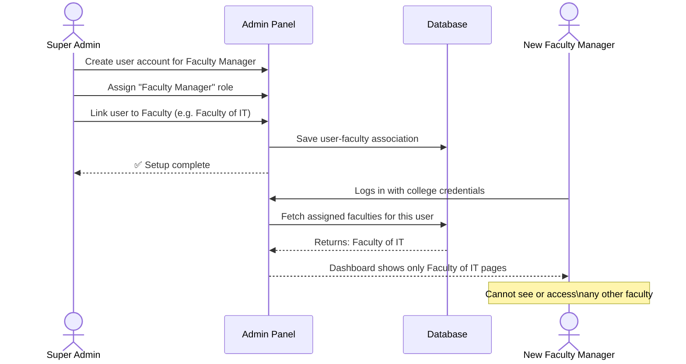

---

## 7. Current vs Proposed System

### Feature Comparison

| Aspect | ❌ Current System | ✅ Proposed System |
|--------|------------------|-------------------|
| **Content Management** | Hard-coded templates (developer writes code) | Visual drag-and-drop page builder |
| **Faculty Control** | Limited to a few text fields in JSON | Full page customisation with any block |
| **Content Updates** | Requires a developer — days or weeks | Self-service — minutes |
| **Design Flexibility** | Fixed layout only | Multiple templates + custom layouts |
| **Media Management** | Basic file uploads | Dedicated media library per faculty |
| **User Roles** | Admin-only editing | Faculty Manager role with scoped permissions |
| **SEO Control** | Global settings only | Faculty-specific SEO management |
| **Content Migration** | Manual process | Automated with data preservation |
| **Maintenance Overhead** | High developer dependency | Dramatically reduced |
| **Scalability** | Each new faculty needs developer work | New faculty → assign manager → they're independent |
| **Brand Consistency** | Enforced by code (but inflexible) | Enforced by block design (flexible within brand) |
| **Staff Training** | N/A (only developers) | One training session covers all faculty sites |

### Before and After: Content Ownership

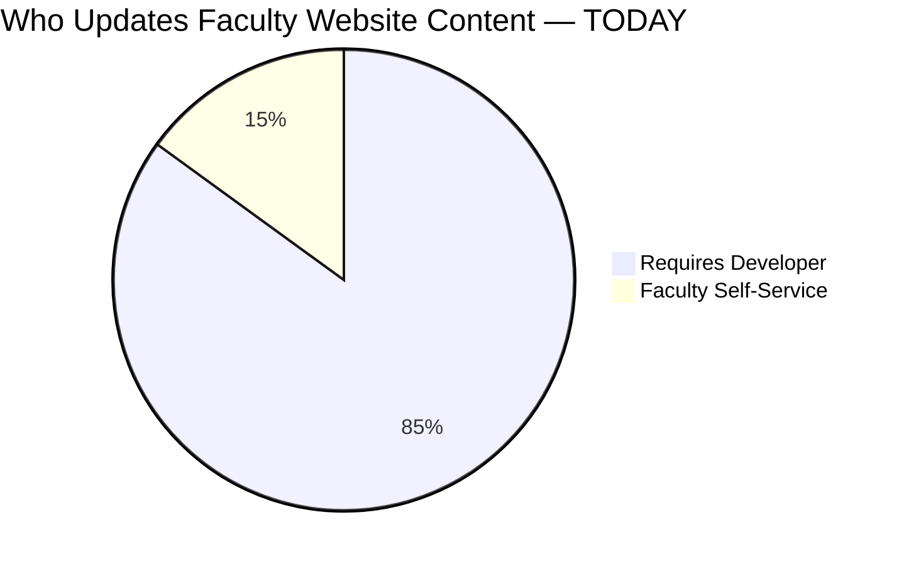

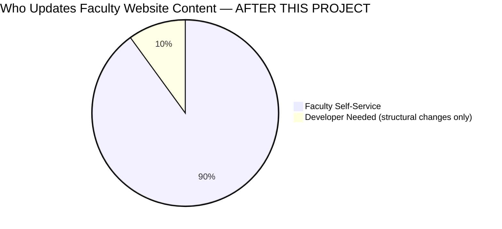

### Existing Architecture — Current State

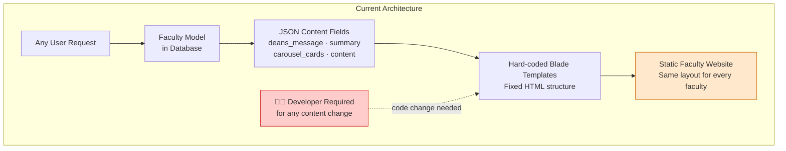

### Proposed Architecture — Future State

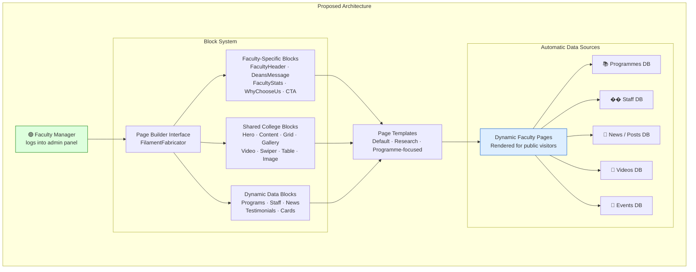

---

## 8. Technical Architecture

> 🔵 **This section is primarily for developers** building and maintaining the system.

### System Architecture Overview (C4-Style)

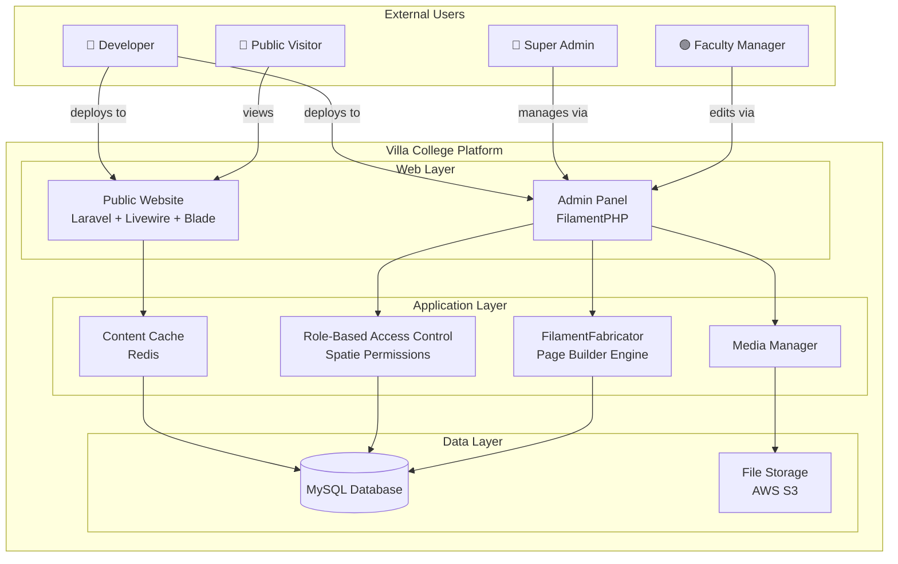

### Database Entity Relationship Diagram

```mermaid
erDiagram
    USERS ||--o{ USER_FACULTY : "assigned to"
    FACULTIES ||--o{ USER_FACULTY : "has managers"
    FACULTIES ||--o| PAGES : "has custom page"
    PAGES }o--|| FACULTY_PAGE_TEMPLATES : "based on"
    USERS ||--o{ FACULTY_PAGE_PERMISSIONS : "has"
    FACULTIES ||--o{ FACULTY_PAGE_PERMISSIONS : "scoped to"

    FACULTIES ||--o{ PROGRAMS : "offers"
    FACULTIES ||--o{ STAFF : "employs"
    FACULTIES ||--o{ POSTS : "publishes"
    FACULTIES ||--o{ VIDEOS : "features"
    FACULTIES ||--o{ EVENTS : "organises"

    USERS {
        bigint id PK
        string name
        string email
        string password
        timestamps
    }

    FACULTIES {
        bigint id PK
        string name
        string slug
        string cover_photo
        json deans_message
        json summary
        json carousel_cards
        json content
        int page_id FK "nullable — links to page builder page"
        int faculty_insight_card_id FK
        bool is_visible
        timestamps
    }

    PAGES {
        bigint id PK
        string title
        string slug
        json blocks "the page builder content"
        int template_id FK "NEW — which template was used"
        int faculty_id FK "NEW — which faculty owns this"
        bool is_published
        timestamps
    }

    FACULTY_PAGE_TEMPLATES {
        bigint id PK
        string name
        text description
        json blocks "default block structure"
        string preview_image
        bool is_active
        timestamps
    }

    FACULTY_PAGE_PERMISSIONS {
        bigint id PK
        bigint user_id FK
        bigint faculty_id FK
        enum permission_type "view · edit · publish · manage"
        timestamp created_at
    }

    USER_FACULTY {
        bigint user_id FK
        bigint faculty_id FK
        string role "ENHANCED: includes Faculty Manager role"
        timestamps
    }
```

### New Database Tables (SQL)

```sql
-- Stores pre-built page templates Faculty Managers can choose from
CREATE TABLE faculty_page_templates (
    id          BIGINT UNSIGNED AUTO_INCREMENT PRIMARY KEY,
    name        VARCHAR(255) NOT NULL,
    description TEXT,
    blocks      JSON NOT NULL,           -- Default block structure as JSON
    preview_image VARCHAR(255),          -- Screenshot shown in template picker
    is_active   BOOLEAN DEFAULT TRUE,
    created_at  TIMESTAMP NULL,
    updated_at  TIMESTAMP NULL
);

-- Fine-grained per-faculty permissions for users
CREATE TABLE faculty_page_permissions (
    id              BIGINT UNSIGNED AUTO_INCREMENT PRIMARY KEY,
    user_id         BIGINT UNSIGNED NOT NULL,
    faculty_id      BIGINT UNSIGNED NOT NULL,
    permission_type ENUM('view','edit','publish','manage') NOT NULL,
    created_at      TIMESTAMP NULL,

    FOREIGN KEY (user_id)    REFERENCES users(id)     ON DELETE CASCADE,
    FOREIGN KEY (faculty_id) REFERENCES faculties(id) ON DELETE CASCADE,
    UNIQUE KEY unique_user_faculty_perm (user_id, faculty_id, permission_type)
);
```

### Modifications to Existing Tables

```sql
-- Add page builder integration columns to the pages table
ALTER TABLE pages
    ADD COLUMN template_id  BIGINT UNSIGNED NULL AFTER slug,
    ADD COLUMN faculty_id   BIGINT UNSIGNED NULL AFTER template_id,
    ADD FOREIGN KEY (template_id) REFERENCES faculty_page_templates(id) ON DELETE SET NULL,
    ADD FOREIGN KEY (faculty_id)  REFERENCES faculties(id) ON DELETE CASCADE;

-- Add role field to the existing user_faculty pivot table
ALTER TABLE user_faculty
    ADD COLUMN role VARCHAR(50) NULL DEFAULT 'manager'
    COMMENT 'Faculty role: manager, staff, viewer';
```

### URL Routing Structure

| URL | What It Serves | Condition |
|-----|----------------|-----------|
| `/faculties/{slug}` | Default faculty view (current hard-coded template) | When no page builder page exists |
| `/faculties/{slug}/page` | Custom page builder page | When `page_id` is set on the faculty |
| `/faculties/{slug}/programmes` | List of programmes for this faculty | Always available |
| `/faculties/{slug}/staff` | Staff directory for this faculty | Always available |
| `/faculties/{slug}/news` | News articles for this faculty | Always available |

> The system automatically chooses between the legacy view and the page builder view based on whether the faculty has a `page_id` set. This ensures zero disruption during migration.

### File Structure — New Files to Create

```
app/
├── Filament/
│   ├── Fabricator/
│   │   └── PageBlocks/
│   │       └── Faculty/                              ← NEW directory
│   │           │
│   │           │  ── Home Page Blocks ──
│   │           ├── FacultyHeaderBlock.php             ← Video hero + nav + CTA (replaces faculty-header.blade.php)
│   │           ├── FacultyNavBlock.php                ← Faculty navigation bar (replaces faculty-nav.blade.php)
│   │           ├── FacultyAboutBlock.php              ← Stats cards + Dean's message (replaces about section in faculty-home)
│   │           ├── WhyChooseUsBlock.php               ← Feature cards on bg image
│   │           ├── FacultyCIEDBlock.php               ← CIED programme showcase cards
│   │           ├── FacultyNewsBlock.php               ← Auto news carousel (replaces news section in faculty-home)
│   │           ├── FacultyCTABlock.php                ← Pre-footer Apply Now / View Programs
│   │           │
│   │           │  ── About Page Blocks ──
│   │           ├── FacultyPageHeroBlock.php           ← Inner page hero + stats row (replaces top of faculty-about)
│   │           ├── MissionVisionBlock.php             ← Vision / Mission / Values 3-card grid
│   │           ├── TeamBlock.php                      ← Tabbed staff grid (Leadership / Academic / Admin)
│   │           ├── ResearchCTABlock.php               ← Research database banner CTA
│   │           ├── FacultyAdvisoryBlock.php           ← Faculty advisory committee members
│   │           ├── AccreditationsBlock.php            ← Memberships + accreditations two-column
│   │           │
│   │           │  ── CIED Page Blocks ──
│   │           ├── CIEDSpotlightBlock.php             ← VIgnite / programme spotlight banner (replaces faculty-cied top)
│   │           ├── CIEDFeaturesBlock.php              ← 3-column CIED feature cards grid
│   │           ├── MentorsBlock.php                   ← Academic + industry mentors two-column
│   │           └── IdeaSubmissionCTABlock.php         ← "Submit Your Business Idea" banner CTA
│   │
│   └── Resources/
│       ├── FacultyPageResource.php                    ← NEW: Admin resource for managing faculty pages
│       └── FacultyTemplateResource.php                ← NEW: Admin resource for managing page templates
├── Policies/
│   ├── FacultyPagePolicy.php                          ← NEW: Restricts page editing to assigned faculty
│   └── FacultyContentPolicy.php                       ← NEW: Restricts content actions to assigned faculty
└── Http/
    └── Livewire/
        └── Website/
            └── Faculties/
                └── Website/
                    ├── FacultyHome.php                ← EXISTS: renders home page (to be migrated to page builder)
                    ├── FacultyCommunities.php         ← EXISTS: student life page
                    └── Components/
                        └── Home/
                            └── FacultyHeader.php      ← EXISTS: to be replaced by FacultyHeaderBlock
```

### Existing Page Blocks (Already Built — Available to All Faculties)

These blocks are already in the system (`faculty_website` branch) and available today:

| Block File | Block Name | Purpose |
|---|---|---|
| `HeroBlock.php` | Hero | Full-width banner with heading and CTA |
| `ContentBlock.php` | Content | Rich text content area |
| `GridBlock.php` | Grid | Multi-column layout container |
| `SpotlightBlock.php` | Spotlight | Icon + heading + text feature highlight |
| `SwiperBlock.php` | Swiper | Auto-sliding image carousel |
| `TableBlock.php` | Table | Formatted data table |
| `VideoBlock.php` | Video | Embedded video player |
| `ImageBlock.php` | Image | Single image with caption |
| `GalleryBlock.php` | Gallery | Photo grid with lightbox |
| `AccordianBlock.php` | Accordion | Collapsible FAQ panels |
| `CardsBlock.php` | Cards | Card grid layout |
| `TestimonialsBlock.php` | Testimonials | Quote / review display |
| `NewsBlock.php` | News | Auto-pulls latest news articles |
| `ProgramBlock.php` | Programs | Auto-pulls faculty programmes |
| `StaffBlock.php` | Staff | Auto-pulls staff directory |

---

## 9. Content Migration Plan

### Overview

All existing faculty content — dean's messages, summaries, carousel cards, and media — must be safely migrated into the new page builder format. No content will be lost. The migration happens in three phases.

### Migration Flow

```mermaid
flowchart LR
    subgraph P1["Phase 1: Backup & Analysis"]
        direction TB
        A1[📊 Analyse existing faculty data] --> A2[💾 Full database backup]
        A2 --> A3[🗺️ Map JSON fields → Blocks]
        A3 --> A4[✅ Validate data integrity]
    end

    subgraph P2["Phase 2: Migration Scripts"]
        direction TB
        B1[⚙️ Write Artisan migration commands] --> B2[Convert Dean's Message → DeansMessageBlock]
        B2 --> B3[Convert Summary → ContentBlock]
        B3 --> B4[Convert Carousel Cards → SwiperBlock]
        B4 --> B5[Migrate media files to new library]
        B5 --> B6[Generate default page per faculty]
    end

    subgraph P3["Phase 3: Testing & Validation"]
        direction TB
        C1[🧪 Test migrated content visually] --> C2[⚖️ Compare original vs new output]
        C2 --> C3[🔧 Fix any discrepancies]
        C3 --> C4[⚡ Performance testing]
        C4 --> C5[👥 User acceptance testing with faculty managers]
    end

    subgraph P4["Phase 4: Go Live"]
        D1[🚀 Deploy to production]
        D2[📡 Monitor & support]
        D3[🗑️ Deprecate legacy templates when all faculties are migrated]
    end

    A4 --> B1
    B6 --> C1
    C5 --> D1
    D1 --> D2 --> D3

    style P1 fill:#fff3cd,stroke:#856404
    style P2 fill:#d1ecf1,stroke:#0c5460
    style P3 fill:#d4edda,stroke:#155724
    style P4 fill:#e2e3e5,stroke:#383d41
```

### JSON Field to Block Mapping

The `Faculty` model currently stores content in five JSON fields. Each maps to one or more new page builder blocks:

| Existing JSON Field | New Page Builder Block | Where it appears | Migration Notes |
|---|---|---|---|
| `deans_message` (text + photo) | `FacultyAboutBlock` (Dean's message sub-fields) | Home Page — About Us section | Dean photo, name, role, and rich message text all move into `FacultyAboutBlock` |
| `summary` (text content) | `FacultyAboutBlock` (about card body) or `FacultyPageHeroBlock` description | Home Page + About Page hero | Short faculty description migrates to the about card; longer text to the about page hero |
| `carousel_cards` (array of images) | `FacultyHeaderBlock` background video/image | Home Page hero | Carousel images become the hero background; video can be added to replace static images |
| `content` (flexible JSON) | `FacultyPageHeroBlock` + `ContentBlock` + `GridBlock` | About Page | Mapped case-by-case per faculty; a migration script will map each faculty's content structure |
| `cover_photo` | `FacultyHeaderBlock` (background video/overlay) + `FacultyPageHeroBlock` (banner image) | Home + About Page hero | Image file moved to media library and referenced by both header blocks |

### Rollback Strategy

If anything goes wrong during migration, the system can be instantly reverted:

```mermaid
flowchart TD
    A[Issue Detected During Migration] --> B{Severity?}
    B -->|Minor: content formatting| C[Fix migration script\nRe-run for affected faculty]
    B -->|Major: data corruption| D[Immediate rollback to backup]
    B -->|Critical: system failure| E[Restore full database backup\nReturn to legacy templates]
    C --> F[Validate fix\nContinue migration]
    D --> G[Investigate root cause\nFix and re-attempt]
    E --> H[Communicate with stakeholders\nPlan new migration date]

    style D fill:#ffe0e0,stroke:#cc0000
    style E fill:#ffcccc,stroke:#cc0000
    style C fill:#fff3cd,stroke:#856404
    style F fill:#d4edda,stroke:#155724
```

---

## 10. Security

### Key Security Principles

| Concern | How It Is Addressed |
|---|---|
| **Unauthorised access** | Role-based permissions — faculty managers can only access their own faculty |
| **Cross-site scripting (XSS)** | All user-entered content is sanitised before rendering |
| **File upload abuse** | Media uploads are validated for type and size; stored outside web root |
| **Audit trail** | All page changes are logged with user, timestamp, and action |
| **Session security** | Standard Laravel session management with CSRF protection |
| **Brute force login** | Rate limiting on the admin login endpoint |

### Optional: Content Approval Workflow

For faculties that require an extra layer of review (e.g. before sensitive content goes live), an approval workflow can be enabled:

```mermaid
stateDiagram-v2
    [*] --> Draft : Faculty Manager creates/edits page
    Draft --> UnderReview : Manager submits for approval
    UnderReview --> Published : Approver approves
    UnderReview --> Draft : Approver requests changes
    Published --> Draft : Manager unpublishes for editing
    Published --> [*] : Page deleted

    note right of UnderReview
        Optional workflow.
        Can be enabled per faculty.
        Approver is typically the
        Faculty Dean or Super Admin.
    end note
```

---

## 11. Success Metrics

### How We Know the System Is Working

```mermaid
xychart-beta
    title "Target Improvements After Launch"
    x-axis ["Content Update Speed", "Faculty Autonomy", "Developer Overhead", "Website Freshness", "User Satisfaction"]
    y-axis "Improvement %" 0 --> 100
    bar [90, 90, 60, 80, 75]
```

### Key Performance Indicators (KPIs)

| Category | Metric | Target | How Measured |
|----------|--------|--------|--------------|
| ⚡ **Performance** | Page load time | < 3 seconds | Google PageSpeed Insights |
| ⚡ **Performance** | System uptime | 99.9% | Server monitoring |
| ⚡ **Performance** | Data integrity after migration | 100% preserved | Migration validation scripts |
| 👤 **User Adoption** | Faculty managers actively using the system | > 80% within 3 months | Admin panel analytics |
| 👤 **User Adoption** | Time to create and publish a page | < 30 minutes | User session tracking |
| 👤 **User Adoption** | User satisfaction score | > 4.5 / 5 | Post-training surveys |
| 👤 **User Adoption** | Reduction in content-related support tickets | ↓ 50% | Help desk metrics |
| 📈 **Business Impact** | Website visitor engagement | ↑ 25% | Google Analytics |
| 📈 **Business Impact** | Content update frequency | ↑ 300% | CMS activity logs |
| 📈 **Business Impact** | Faculty self-service rate | 90% | Support request categories |
| 🛠️ **Development** | Test code coverage | > 85% | Automated test suite |
| 🛠️ **Development** | Production bug reports | < 5 per month | Issue tracker |

---

## 12. Implementation Timeline & Phases

### Phase Overview

```mermaid
gantt
    title Faculty Website Page Builder — Implementation Timeline
    dateFormat  YYYY-MM-DD
    section Phase 1: Foundation
    Role & Permission System       :crit, p1-1, 2025-01-01, 7d
    Core Faculty Page Blocks       :crit, p1-2, after p1-1, 14d
    Basic Page Builder Interface   :crit, p1-3, after p1-1, 10d
    Content Migration Scripts      :p1-4, after p1-2, 7d
    Phase 1 Testing                :p1-5, after p1-3, 3d

    section Phase 2: Enhancement
    Advanced Faculty Blocks        :p2-1, after p1-5, 10d
    Page Template System           :p2-2, after p1-5, 8d
    Quality Assurance              :p2-3, after p2-1, 5d
    Documentation & Training Prep  :p2-4, after p2-2, 7d

    section Phase 3: Pilot & Launch
    Pilot Deployment (select faculties) :crit, p3-1, after p2-4, 7d
    Faculty Manager Training            :p3-2, after p2-4, 5d
    Feedback & Performance Tuning       :p3-3, after p3-1, 4d
    Full Production Rollout             :crit, p3-4, after p3-3, 3d

    section Phase 4: Advanced Features
    Multi-language Support         :p4-1, after p3-4, 14d
    Analytics Integration          :p4-2, after p3-4, 10d
    Advanced Interactive Blocks    :p4-3, after p4-1, 21d
    Continuous Improvement         :p4-4, after p4-2, 30d
```

### Phase Breakdown

| Phase | Duration | Key Deliverables | Success Criteria | Risk |
|-------|----------|------------------|-----------------|------|
| **Phase 1: Foundation** | 4–6 weeks | Role system · Core faculty blocks · Migration scripts | All existing content preserved with zero data loss | 🟡 Medium |
| **Phase 2: Enhancement** | 3–4 weeks | Advanced blocks · Template system · Training materials | Full feature parity with current hard-coded system | 🟢 Low |
| **Phase 3: Pilot & Launch** | 2–3 weeks | Pilot with 2–3 faculties · Training sessions · Production rollout | 80% of pilot users self-sufficient after training | 🔴 High |
| **Phase 4: Advanced** | Ongoing | Multi-language · Analytics · Interactive forms | Enhanced functionality beyond current baseline | 🟢 Low |

### Critical Path

```mermaid
flowchart LR
    A[🔐 Role & Permission System] --> B[🖥️ Page Builder Interface]
    C[🧱 Core Faculty Blocks] --> D[⚙️ Migration Scripts]
    B --> E[✨ Advanced Blocks]
    D --> F[📄 Template System]
    E --> G[🧪 Quality Assurance]
    F --> G
    G --> H[🧑‍💻 Pilot Deployment]
    H --> I[🚀 Full Production Rollout]

    style A fill:#ff9999,stroke:#cc0000
    style B fill:#ff9999,stroke:#cc0000
    style C fill:#ff9999,stroke:#cc0000
    style D fill:#ff9999,stroke:#cc0000
    style E fill:#ffd57e,stroke:#856404
    style F fill:#ffd57e,stroke:#856404
    style G fill:#ffd57e,stroke:#856404
    style H fill:#b3e5fc,stroke:#0277bd
    style I fill:#b3e5fc,stroke:#0277bd
```

### Phase 4 Advanced Features

| Feature | Description | Benefit |
|---|---|---|
| **Multi-language Support** | Faculty content in multiple languages | Serves international students |
| **Analytics Dashboard** | Page visits, block engagement, user behaviour | Faculty managers see what's working |
| **Event Calendar Block** | Embeddable events per faculty | Keeps students informed |
| **Programme Comparison Block** | Side-by-side programme comparison tool | Helps students choose |
| **Research Showcase Block** | Highlights faculty research outputs | Builds faculty reputation |
| **Alumni Spotlight Block** | Feature notable alumni | Builds community and trust |
| **Interactive Forms Block** | Contact forms, application enquiry forms | Increases conversions |

---

## 13. Risk Assessment & Mitigation

### Risk Overview

```mermaid
quadrantChart
    title Risk Matrix — Probability vs Impact
    x-axis Low Impact --> High Impact
    y-axis Low Probability --> High Probability
    quadrant-1 Monitor Closely
    quadrant-2 Top Priority
    quadrant-3 Low Priority
    quadrant-4 Manage Proactively
    Data Loss During Migration: [0.90, 0.30]
    Security Vulnerabilities: [0.85, 0.35]
    Low Faculty Adoption: [0.80, 0.55]
    Resistance to Change: [0.55, 0.55]
    Performance Degradation: [0.50, 0.25]
    Brand Dilution: [0.80, 0.20]
    Timeline Delays: [0.55, 0.50]
    Content Inconsistency: [0.50, 0.50]
    Budget Overrun: [0.45, 0.20]
```

### Full Risk Register

| Risk | Probability | Impact | Level | Mitigation | Contingency |
|------|------------|--------|-------|-----------|------------|
| Data loss during migration | 🟡 Medium | 🔴 High | 🔴 **HIGH** | Full DB backups · migration dry runs · validation scripts | Immediate rollback to previous system |
| Security vulnerability | 🟡 Medium | 🔴 High | 🔴 **HIGH** | Security audit · input sanitisation · regular updates | Emergency patch process |
| Low faculty adoption | 🟡 Medium | 🔴 High | 🔴 **HIGH** | Training programme · change champions · simple UI | Enhanced one-on-one support |
| Resistance to change | 🟡 Medium | 🟡 Medium | 🟡 **MEDIUM** | Gradual rollout · showcase early wins · gather feedback | One-on-one support sessions |
| Performance degradation | 🟢 Low | 🟡 Medium | 🟡 **MEDIUM** | Load testing · Redis caching · performance benchmarks | Scale server resources |
| Brand dilution | 🟢 Low | 🔴 High | 🟡 **MEDIUM** | Pre-branded blocks · no free-form CSS for managers | Brand compliance review |
| Content inconsistency | 🟡 Medium | 🟡 Medium | 🟡 **MEDIUM** | Style guides · templates · optional approval workflow | Content audit |
| Timeline delays | 🟡 Medium | 🟡 Medium | 🟡 **MEDIUM** | Buffer time built in · agile delivery · phased rollout | Descope Phase 4 features |
| Budget overrun | 🟢 Low | 🟡 Medium | 🟢 **LOW** | Detailed estimates · change control process | Scope adjustment |

### Risk Mitigation Timeline

```mermaid
timeline
    title Risk Mitigation Activities Throughout the Project
    section Pre-Development
        Risk Assessment       : Stakeholder risk workshops
                             : Identify and document all risks
                             : Agree mitigation strategies
        Backup Infrastructure : Set up automated DB backups
                             : Test restore procedures
                             : Document rollback steps
    section Development Phase
        Security Hardening   : Code review for all user input handling
                            : Authentication and authorisation testing
                            : Dependency vulnerability scanning
        Performance Baseline : Set page load benchmarks
                            : Load testing plan
                            : Redis caching configuration
    section Pre-Deployment
        Migration Testing    : Migration dry runs on staging
                           : Data validation scripts
                           : Faculty sign-off on migrated content
        User Preparation    : Training materials ready
                           : Identify faculty change champions
                           : Support helpdesk briefed
    section Post-Deployment
        Active Monitoring   : Daily performance monitoring
                          : User adoption tracking
                          : Weekly feedback sessions
        Continuous Review   : Monthly risk register review
                          : Mitigation effectiveness check
                          : Lessons learned documentation
```

---

## 14. Training & Onboarding

### Training Approach

Training is designed so that **a person with no technical background can become fully independent within a single session**. Because every faculty uses the exact same page builder, training only needs to happen once per person — regardless of which faculty they work for.

```mermaid
flowchart TD
    A[👤 New Faculty Manager Identified] --> B[Account Created by Super Admin]
    B --> C[Welcome Email with Login Details]
    C --> D[Training Session — 2 Hours]

    subgraph Training["Training Session Content"]
        T1[Overview: What is the page builder?]
        T2[Hands-on: Log in & navigate the admin panel]
        T3[Hands-on: Create a page from a template]
        T4[Hands-on: Add and rearrange blocks]
        T5[Hands-on: Upload images to media library]
        T6[Hands-on: Preview and publish a page]
        T7[Q&A and practice time]
        T1 --> T2 --> T3 --> T4 --> T5 --> T6 --> T7
    end

    D --> Training
    Training --> E[Manager practices independently on staging site]
    E --> F{Confident?}
    F -->|Yes| G[✅ Access granted to production]
    F -->|No| H[Follow-up 1:1 support session]
    H --> E

    style G fill:#d4edda,stroke:#155724
```

### Training Resources

| Resource | Format | Audience | Description |
|---|---|---|---|
| Quick Start Guide | PDF / Printed | Faculty Managers | 1-page visual guide: log in → build → publish |
| Full User Guide | Online document | Faculty Managers | Step-by-step with screenshots for every feature |
| Video Walkthrough | Screen recording | Faculty Managers | 10-minute video covering all key tasks |
| Block Reference Card | PDF | Faculty Managers | One-liner description of every available block |
| Technical Setup Guide | Markdown | Developers | Environment setup, architecture, and deployment |
| Admin Handbook | Markdown | Super Admins | User management, roles, and template management |

### Who Trains Whom

```mermaid
graph TD
    DEV[👨‍💻 Development Team] -->|trains| SA[🔴 Super Admins]
    SA -->|trains| FM[🟢 Faculty Managers]
    FM -->|supports| FS[🔵 Faculty Staff]

    DEV -->|provides| TM[Training Materials]
    TM --> SA
    TM --> FM

    style DEV fill:#dde8ff,stroke:#0055cc
    style SA fill:#ffdddd,stroke:#cc0000
    style FM fill:#ddffdd,stroke:#007700
```

---

## 15. Glossary

> A plain-English reference for terms used throughout this document.

| Term | What It Means |
|------|--------------|
| **Admin Panel** | The back-end interface where staff log in to manage the website. Not visible to the public. Built with FilamentPHP. |
| **Block** | A self-contained section of a page (e.g. a hero banner, a news list, a staff directory). Blocks are pre-designed and pre-branded. |
| **Brand Consistency** | Ensuring all Villa College websites look and feel the same — same fonts, colours, and visual style. |
| **Cache / Redis** | A temporary memory store that saves copies of pages so they load faster for visitors. |
| **CMS** | Content Management System — software that lets non-technical users create and manage website content. |
| **Draft** | A version of a page that has been saved but is not yet visible to the public. |
| **Dynamic Content** | Content that is automatically updated from the database (e.g. a list of programmes that updates when a new programme is added). |
| **Faculty Manager** | A staff member given permission to manage their faculty's website content. |
| **FilamentFabricator** | The specific page builder plugin used in this project. It is part of the FilamentPHP admin panel framework. |
| **FilamentPHP** | The PHP framework used to build the admin panel of the Villa College website. |
| **JSON** | A data format used to store structured information. In the current system, faculty content is stored as JSON — this is being replaced by the page builder. |
| **Laravel** | The PHP web application framework the Villa College website is built on. |
| **Media Library** | A storage area within the admin panel where images, documents, and videos are uploaded and managed. |
| **Migration** | The process of moving existing content from the old system format to the new page builder format. |
| **Page Builder** | A visual editor that lets you build a web page by placing and arranging content blocks — no coding required. |
| **Permissions** | Rules that define what a user is allowed to do within the system. |
| **Publish** | Making a page live and visible to the public. |
| **RBAC** | Role-Based Access Control — a security model where users are assigned roles, and each role has specific permissions. |
| **Redis** | The caching software used to improve page load performance. |
| **Role** | A label assigned to a user (e.g. "Faculty Manager") that determines what they can access. |
| **SEO** | Search Engine Optimisation — practices that help pages rank better in Google and other search engines. |
| **Slug** | The URL-friendly version of a name. For example, "Faculty of IT" has the slug `faculty-of-it`, used in the URL `/faculties/faculty-of-it`. |
| **Staging Environment** | A private copy of the website used for testing. Changes here do not affect the live site. |
| **Super Admin** | A user with full access to all parts of the admin panel, including all faculties. |
| **Template** | A pre-built page layout that Faculty Managers can start from instead of building from scratch. |
| **XSS** | Cross-Site Scripting — a security vulnerability where malicious code is injected into a page. The system sanitises all input to prevent this. |

---

## 16. FAQ

**Q: Do I need to know how to code to manage my faculty's website?**
No. The page builder is designed for non-technical users. If you can use Microsoft Word or drag and drop files, you can use the page builder.

---

**Q: What happens to the existing content on faculty websites?**
All existing content — dean's messages, summaries, carousel images, and media — will be automatically migrated to the new system. You will not lose anything.

---

**Q: Can I accidentally break the branding by choosing the wrong colours or fonts?**
No. The visual design of each block is controlled by the development team. As a Faculty Manager, you control the *content* (text, images, what appears), not the *design* (colours, fonts, spacing). This is intentional — it ensures every faculty website always matches Villa College's brand.

---

**Q: If I learn how to use the page builder for my faculty, can I help another faculty?**
Yes — and this is one of the key benefits of this approach. The page builder is the same for every faculty. Once you know how to use it for one faculty, you can use it for any other (if you are given access).

---

**Q: What if I publish something by mistake?**
You can unpublish a page at any time. You can also save your work as a draft before going live, so you always have a chance to review.

---

**Q: Can two people from the same faculty edit the page at the same time?**
Multiple people can be assigned as Faculty Managers for the same faculty. However, editing the same page simultaneously is not recommended as one person's changes may overwrite the other's. Coordinate within your faculty to avoid this.

---

**Q: How often can I update my faculty's website?**
As often as you like. There is no limit. In fact, keeping content fresh and up to date is one of the main goals of this project.

---

**Q: Who do I contact if something is not working?**
Contact the Villa College IT / Web Team. For content questions, refer to the Quick Start Guide or your faculty's Super Admin.

---
